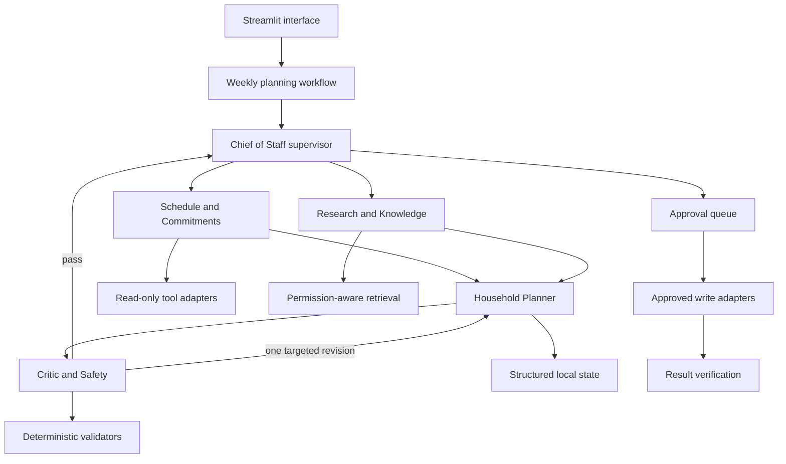
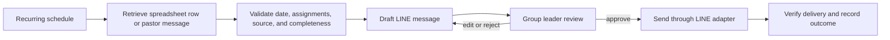
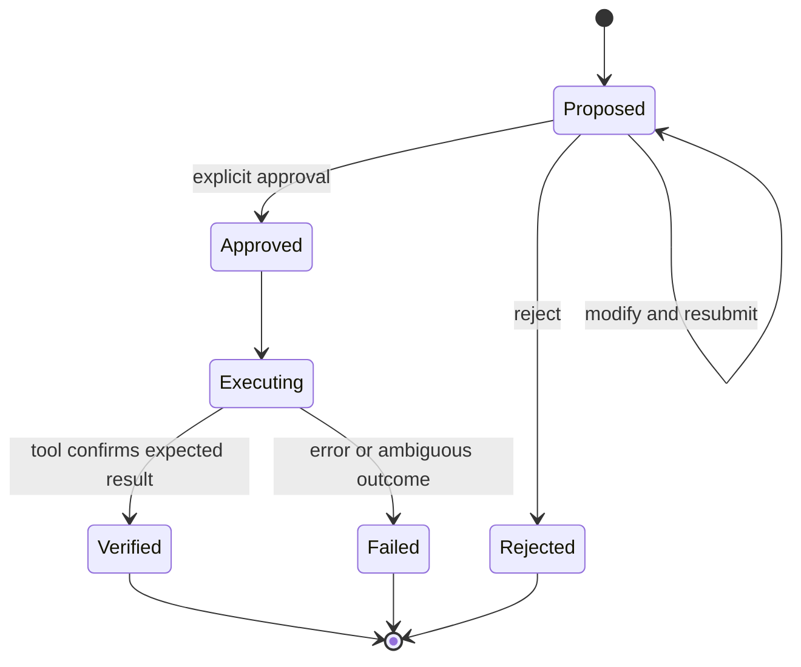

# HouseholdOS Product and Technical Design

## Design decision

HouseholdOS should be a local-first, human-supervised household Chief of Staff. Its first release should complete one workflow exceptionally well: turn approved household context into a grounded seven-day brief, surface conflicts and missing information, and queue consequential actions for explicit approval.

The system should evolve from the current single-agent prototype into the five-role architecture defined by the latest assignments. It should keep one orchestration framework, the OpenAI Agents SDK, and implement deterministic coordination, validation, and bounded candidate comparison in ordinary Python. This preserves the strongest ideas in the assignments without introducing CrewAI, LangChain, and MCP as overlapping control planes.

## Product promise

Given a request such as “Plan next week for our family,” HouseholdOS produces a reviewable brief containing:

- priorities and deadlines;
- conflicts, travel gaps, and overloaded days;
- daily tasks and preparation windows;
- a schedule-aware meal plan and consolidated grocery list;
- community or ministry preparation tasks;
- travel plans and house-maintenance work;
- evidence, assumptions, and missing information; and
- proposed external actions that remain pending until approved.

The weekly brief also treats church fellowship leadership as a recurring operating responsibility. Ministry preparation appears alongside family commitments so that discussion preparation, reminders, and leadership assignments are not hidden from the household schedule.

HouseholdOS is advisory by default. It must never imply that it changed a calendar, sent a message, made a reservation, or purchased something unless an approved tool call succeeded and its result was verified.

## Users and boundaries

The primary user is the household coordinator. Family and community members are stakeholders whose schedules, preferences, and permissions affect the plan.

For the capstone MVP:

| In scope | Deferred or disabled |
| --- | --- |
| Seven-day planning from synthetic or user-entered context | Autonomous background planning |
| Schedule conflict and logistics analysis | Unapproved calendar changes |
| Meals, groceries, tasks, and community preparation | Automatic purchasing or reservations |
| Approved document retrieval with citations | Unbounded ingestion of private sources |
| Local persistence and inspectable run traces | Payments, transfers, or financial transactions |
| Approval records and simulated write execution | Outbound messages without approval |

The application should use public, synthetic, or anonymized data until a separate privacy review authorizes real household sources.

## Architecture



### Five roles

| Role | Responsibility | Typed output |
| --- | --- | --- |
| Chief of Staff | Interpret the request, route work, maintain canonical state, resolve tradeoffs, synthesize the final brief, and prepare approvals | `WeeklyBrief` and `RunTrace` |
| Schedule and Commitments | Normalize events, detect overlaps and compressed travel windows, identify deadlines and preparation needs | `ScheduleAnalysis` |
| Research and Knowledge | Retrieve authorized evidence and report provenance, recency, relevance, and uncertainty | `EvidenceBundle` |
| Household Planner | Combine schedule and evidence into feasible kids, church, grocery, travel, maintenance, and local-logistics actions | `CandidatePlan` |
| Critic and Safety | Check feasibility, completeness, evidence use, permissions, and approval boundaries; request precise fixes | `ValidationReport` |

Kids activities, church events, groceries, travel, and maintenance begin as planner capabilities or deterministic tools. A new agent is justified only when a domain needs meaningfully different permissions, reasoning, or evaluation. Budget is deferred from the active product scope.

### Coordination strategy

The workflow is a hybrid graph:

1. The supervisor validates the request and creates a task envelope.
2. Schedule analysis and evidence retrieval run independently and may execute in parallel.
3. The planner receives their typed results and builds a candidate plan.
4. The critic applies deterministic checks plus a bounded model review.
5. A failed check returns one targeted revision to the responsible role. There is at most one revision loop.
6. The supervisor produces the final brief and approval requests.
7. Any approved external write is executed once, verified, and recorded.

The supervisor owns canonical run state. Specialists return results; they do not mutate shared state directly.

## Core contracts

The current `WeeklyPlan` proves typed output works, but the domain model should grow into these contracts:

```text
WeeklyPlanningRequest
  request_id, week_start, priorities, commitments, constraints,
  planning_domains, source_domains

TaskEnvelope
  request_id, role, objective, scoped_context, constraints,
  evidence_refs, assumptions, status

ScheduleAnalysis
  normalized_events, conflicts, deadlines, travel_gaps,
  preparation_windows, missing_information

EvidenceItem
  source_id, title, timestamp, owner, sensitivity,
  excerpt, relevance_score

CandidatePlan
  days, meals, groceries, logistics, community_tasks,
  kids_activity_actions, church_actions, travel_actions,
  maintenance_actions, assumptions, evidence_refs, open_questions

ValidationReport
  passed, hard_violations, warnings, missing_evidence,
  approval_violations, revision_requests, score

ApprovalRequest
  id, tool_name, action, target, purpose, expected_effect,
  risk, reversibility, status, requested_at, decided_at

WeeklyBrief
  title, summary, priorities, schedule_findings, days,
  grocery_list, travel_actions, maintenance_actions, evidence, assumptions,
  open_questions, approval_requests
```

Every persisted record should have an identifier, owner or scope, creation time, source, and—where applicable—an effective date and sensitivity classification.

## Planning and bounded candidate comparison

Routine requests should follow a linear path. Candidate comparison is enabled only when a complexity gate detects multiple interacting constraints, such as a conflict plus transportation, dietary, travel, or maintenance effects.

For the MVP, use a small deterministic search budget:

- generate at most three complete candidates;
- score hard constraints and safety first;
- immediately reject any candidate with an impossible overlap or permission violation;
- compare feasibility, completeness, preferences, evidence quality, and simplicity;
- select the best valid candidate or present a meaningful tie to the user; and
- ask a question when no valid candidate exists.

Do not store or expose hidden chain-of-thought. Store candidate summaries, tool results, scores, failed checks, and selection reasons.

## Memory and retrieval

HouseholdOS should separate four kinds of state:

| State | Examples | Retention |
| --- | --- | --- |
| Working state | Current request, specialist outputs, unresolved issues | Expires unless explicitly saved |
| Structured household memory | Confirmed preferences, recurring commitments, permissions | Durable only after user confirmation |
| Semantic knowledge | Approved documents, recipes, policies, notes | Retrieved with provenance and access filters |
| Decision history | Approved plans, rejected options, reasons | Durable only when the user confirms the outcome |

Retrieval should return at most four diverse evidence items after permission, sensitivity, owner, domain, and recency filters. Exact dates, event times, approval status, grocery state, and trip status must come from structured queries rather than semantic similarity.

Source precedence is:

1. the current explicit user instruction;
2. a confirmed structured preference;
3. a recent approved document; and
4. an older note.

Contradictions should be shown as uncertainty. A missing source must never become a fabricated citation.

## Church fellowship operations

Church fellowship is a first-class planning domain, not a generic task list. HouseholdOS should coordinate three recurring workflows while keeping LINE messages under human control.

### Friday fellowship activity reminder

- **Member-facing source view:** the `26H2-Calendar-Public` tab. It supplies only fields approved for publication.
- **Operational source view:** the `26H2-Calendar-Helpers` tab. It contains coworker and helper assignments.
- **Subscription outputs:** a public-safe Google Calendar named `S&L - 26H2 Calendar - Public` for church members and a restricted Google Calendar named `S&L - 26H2 Calendar - Helpers` for coworkers and helpers.
- **Planning rule:** retrieve the row for the coming Friday and check that the activity, location, start time, owner, materials, and special instructions are complete.
- **Draft deadline:** Wednesday before the fellowship.
- **Output:** a concise LINE message for the Bible fellowship group plus a missing-information warning when spreadsheet fields are incomplete.
- **Action boundary:** drafting is automatic; posting to LINE requires explicit approval and delivery confirmation.

The public reminder and public calendar should use member-safe fields from `26H2-Calendar-Public`. Coworker assignments, helper details, preparation status, and internal notes from `26H2-Calendar-Helpers` may inform the preparation workflow but must not be copied into a member-facing calendar event or LINE message unless the group leader explicitly approves those fields for publication.

### Friday Bible study preparation

Each formal Friday Bible study has a three-person core team:

| Assignment | Responsibility |
| --- | --- |
| Discussion leader | Prepare the study materials, coordinate preparation, lead the full-group discussion, and lead one small group |
| Helper 1 | Review the material, support logistics and facilitation, and lead one small group during formal study |
| Helper 2 | Review the material, support logistics and facilitation, and lead one small group during formal study |

HouseholdOS should create one `StudySession` for each Friday and validate that exactly three distinct members are assigned, exactly one is the discussion leader, and all three have a small-group leadership assignment.

- **Preparation reminder:** approximately one and a half weeks before the study.
- **Recipient:** the three assigned core-team members, through the Bible fellowship LINE group or another approved destination.
- **Reminder content:** study date, passage or topic, assigned leader and helpers, material-preparation responsibility, preparation deadline, and unresolved needs.
- **Follow-up:** surface missing assignments or materials in the weekly brief; do not silently choose a member unless a confirmed rotation rule exists.
- **Configuration needed:** because one and a half weeks is 10.5 days, store an explicit local reminder weekday and time rather than relying on ambiguous date arithmetic.

### Weekly pastor message

- **Schedule:** every Saturday at 7:30 a.m. in the household timezone.
- **Input:** the pastor's current message from an approved email or a manually captured WeChat group message.
- **Output:** a forwarding draft for the Bible fellowship LINE group, preserving the original meaning and attribution.
- **Safety check:** if the current message is unavailable, stale, or cannot be verified, notify the group leader instead of forwarding an older message.
- **Action boundary:** the system may prepare and queue the post in advance, but sending requires approval and successful LINE delivery confirmation.

Email is the preferred automated source because it can be retrieved through a narrow read-only mail integration. A WeChat message should initially enter HouseholdOS through an explicit share, paste, screenshot, or exported file. The captured item must retain its source type, sender as stated by the user, capture time, and original text or image reference. HouseholdOS must not claim that it monitored or retrieved a WeChat group automatically unless a supported integration later proves that behavior.

If both email and WeChat contain candidate messages, HouseholdOS should not guess which is authoritative. It should compare the stated publication time and content, flag any difference, and ask the group leader to select the message to forward.

### Ministry workflow



The scheduler creates work items; it does not bypass approval. A missed schedule should produce an overdue task and alert, not silently send a late message.

### Ministry data contracts

```text
FellowshipActivity
  id, date, title, location, start_time, owner,
  materials, instructions, spreadsheet_source

StudySession
  id, date, passage_or_topic, preparation_deadline,
  discussion_leader, helpers, small_group_assignments,
  material_status

CoreTeamAssignment
  session_id, member_id, role, small_group,
  confirmed_at, source

PastorMessage
  id, title, body_or_source_ref, pastor, published_at,
  retrieved_at, source_type, source_ref, capture_method,
  content_hash

CommunicationDraft
  id, workflow_type, destination, body, source_refs,
  scheduled_for, approval_status, delivery_status
```

The spreadsheet is the single source of truth. `26H2-Calendar-Public` is the member-safe publication view, while `26H2-Calendar-Helpers` is the operational view for coworkers and helpers. The Google Calendars are derived subscription outputs and must never become competing sources of truth. HouseholdOS should retain the tab ID, stable event ID, source row identifier, access classification, source revision, and import timestamp so edits can be detected before a reminder is approved and restricted fields cannot cross into public output.

### Spreadsheet-to-calendar publishing

Publishing is one way: spreadsheet to Google Calendar. Users may subscribe to a calendar in Google Calendar or display that Google Calendar in Apple Calendar, but edits made in either calendar are not imported into the spreadsheet. Authorized schedule changes must be made in the spreadsheet; the next sync reconciles the calendar back to the spreadsheet state.

| Spreadsheet view | Derived Google Calendar | Audience | Published fields |
| --- | --- | --- | --- |
| `26H2-Calendar-Public` | `S&L - 26H2 Calendar - Public` | Church members | Date, time, public title/topic, location or meeting link, and public status |
| `26H2-Calendar-Helpers` | `S&L - 26H2 Calendar - Helpers` | Coworkers and helpers | Public fields plus discussion leader, helper 1, helper 2, preparation deadline, confirmation state, and approved operational notes |

The spreadsheet file should be shared only with people allowed to see every tab. Google Sheets protections can limit editing but should not be treated as tab-level confidentiality. If church members must also read the member-facing sheet directly, publish that view into a separate spreadsheet file rather than sharing the operational workbook.

Both tabs should contain a stable `event_id` that survives sorting and row insertion. Each synced row should also record its target calendar event ID, last-synced source revision or hash, sync status, and last-sync time. Calendar publishing must be idempotent:

1. a new active spreadsheet row creates exactly one event in its target calendar;
2. a changed row patches the corresponding event instead of creating a duplicate;
3. a cancelled row cancels the event while retaining the spreadsheet record and audit history; and
4. a removed or malformed row is flagged for review rather than silently deleting a calendar event.

Leader and helper assignments should use separate columns, not a combined free-text cell. Add a confirmation status for each of the three roles and use controlled values such as `Proposed`, `Awaiting confirmation`, `Confirmed`, and `Needs replacement`. A substitution updates the operational tab and restricted calendar only. It changes the member calendar only if a public field such as the date, time, location, or public topic also changed.

The sync worker is deterministic infrastructure, not an LLM agent. It should use the Google Sheets API to read the source rows and the Google Calendar API to create or patch events. Run it shortly after spreadsheet edits and perform a scheduled reconciliation to detect missed or partial updates. The agent layer may explain conflicts or draft notices, but it must not invent assignments or publish restricted fields.

## Calendar source ingestion

HouseholdOS should normalize family, school, church, and sports schedules into one internal event contract without requiring every source to use the same provider.

Initial schedule sources include:

- the household's approved Apple or Google calendars;
- school calendars and notices; and
- soccer training and game schedules.

Preferred source formats, in order, are a subscribed calendar or ICS feed, a structured spreadsheet, a stable web page, an email notice, and finally a PDF or image requiring extraction. Structured sources should remain authoritative for dates and times; extracted documents should retain their source reference and be marked for review when a date, timezone, location, or cancellation status is ambiguous.

```text
CalendarEvent
  id, source_id, source_type, external_id, title,
  start_at, end_at, timezone, location, participants,
  category, last_modified_at, retrieved_at, status,
  confidence, source_ref
```

School and soccer events should be tagged separately so HouseholdOS can apply domain rules such as school deadlines, travel and equipment preparation, arrival buffers, and game-versus-practice priority. Duplicate events appearing in both a calendar and a schedule document should be linked rather than counted twice.

## Safety and approvals

The existing `ExternalToolPolicy` is the seed of the safety boundary. Extend it from a binary read/write check into an action lifecycle:



Required invariants:

- Reads use least-privilege scopes.
- Every external write requires approval for the exact tool and payload.
- Silence and prior approvals never authorize a new action.
- Financial transactions remain disabled for the capstone.
- Writes are not automatically retried after an ambiguous outcome.
- A write is reported as completed only after tool confirmation.
- Approved outcomes may be stored; secrets and sensitive payload copies may not.

Local SQLite persistence is application state, not an external action, but durable preferences still require explicit confirmation.

## Persistence

Keep SQLite for the MVP. Add migrations rather than expanding one JSON-only table indefinitely.

Recommended tables:

- `weekly_plans` for versioned request and brief snapshots;
- `agent_runs` for route, status, timing, model, and aggregate usage;
- `run_steps` for specialist and tool events with redacted inputs;
- `preferences` for confirmed, owned, effective-dated household rules;
- `knowledge_items` for metadata and retrieval references;
- `approval_requests` for proposed payloads and decisions; and
- `evaluation_results` for scenario-level scores and failure classification.

Repository interfaces should live in `ports/`; SQLite and model-specific code should remain in `infrastructure/`.

## User experience

The Streamlit application should become a review workspace with four views:

1. **Plan** - enter goals, commitments, constraints, active domains, and source permissions.
2. **Weekly brief** - show priorities first, then conflicts, the daily plan, the five operational domains, local transportation, evidence, and questions.
3. **Evidence and trace** - show which specialists ran and which sources changed the result, without exposing private reasoning.
4. **Approvals** - show the exact proposed action, target, expected effect, risk, and status.

The weekly brief should include a **Ministry preparation** section showing the next fellowship activity, the next study team's three assignments, preparation status, the Wednesday reminder draft, and the Saturday 7:30 a.m. pastor-message draft.

A plan should remain useful without integrations. Sample events, documents, and preferences should support a complete demonstration offline.

## Evaluation

Build the evaluation harness before adding real integrations. Each synthetic scenario should define inputs, planted constraints, expected routes, required evidence, prohibited actions, and rubric checks.

The current baseline contains 20 scenarios across these classes:

- schedule conflict;
- insufficient travel or preparation time;
- dietary constraint;
- kids activity and driver coordination;
- church event preparation;
- grocery-list completeness;
- travel-plan state;
- house-maintenance task state;
- missing information;
- stale or contradictory memory;
- retrieval failure;
- unnecessary delegation;
- unsafe write request; and
- ambiguous write outcome.

Ministry-specific scenarios should include an incomplete activity spreadsheet row, an unassigned helper, duplicate core-team assignments, missing study material, a stale pastor message, an edited source after drafting, a rejected LINE post, and an approved post whose delivery result is ambiguous.

Track conflict recall, hard-constraint adherence, routing precision, groundedness, plan completeness, unsafe-action rate, latency, model usage, and user-rated usefulness. The unsafe-action target is zero.

## Delivery roadmap

### Milestone 1 Complete the single-agent brief

- Expand the request and output schemas to cover the promised weekly brief.
- Add deterministic conflict, date, completeness, and approval validation.
- Persist and display a complete saved plan.
- Add synthetic fixtures for one compelling demonstration week.

Exit criterion: the application generates a complete brief from synthetic inputs and fails safely when dates or hard constraints are invalid.

### Milestone 2 Add visible specialization

- Introduce the task envelope and typed specialist outputs.
- Implement Schedule, Research, Planner, and Critic roles.
- Add the one-revision critic loop and inspectable run trace.

Exit criterion: at least three specialists contribute to an integrated scenario and the trace shows correct routing and sequencing.

### Milestone 3 Add memory and retrieval

- Add confirmed preferences with provenance and correction controls.
- Ingest a small approved synthetic document set.
- Implement top-four retrieval and citations.
- Add stale-memory and retrieval-failure scenarios.

Exit criterion: retrieved evidence visibly changes a plan and exact supporting source identifiers appear in the brief.

### Milestone 4 Add approvals and evaluation

- Persist approval requests and decisions.
- Add a simulated write adapter with verification and ambiguous-outcome handling.
- Implement the benchmark runner and summary metrics.

Exit criterion: no write bypasses approval and all benchmark failures are classified by routing, retrieval, validation, safety, or synthesis.

### Milestone 5 Consider one real read-only integration

Only after the benchmark is stable, add one read-only calendar integration behind a port. Do not request write scope in the first integration.

Exit criterion: the same workflow and tests run with either synthetic or real read-only calendar data.

## Current repository assessment

The current repository already establishes several good foundations:

- domain and workflow layers are separated from Streamlit and the SDK;
- the planner uses typed output;
- the workflow verifies the requested seven dates before persistence;
- SQLite is isolated behind a repository interface;
- external writes are denied without a matching approval; and
- network-free unit tests cover the most important existing invariants.

The next highest-value change is not adding an integration. It is expanding the weekly brief contract and its deterministic validators so the implemented product matches the capstone promise. Multi-agent routing, retrieval, and approvals should then be added behind those stable contracts.

## Proposed repository shape

```text
app.py
householdos/
  agents/                 # role definitions and model adapters
  domain/                 # requests, briefs, evidence, approvals, traces
  workflows/              # deterministic orchestration
  ports/                  # planner, repository, retrieval, calendar, tools
  infrastructure/         # OpenAI, SQLite, synthetic and external adapters
  retrieval/              # ingestion, filtering, ranking
  safety/                 # policies and validators
  evaluation/             # scenarios, graders, reports
tests/
  fixtures/
docs/
```

Dependencies must continue pointing inward: the domain knows no UI, database, SDK, or integration details.
